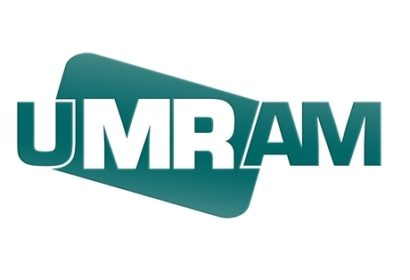
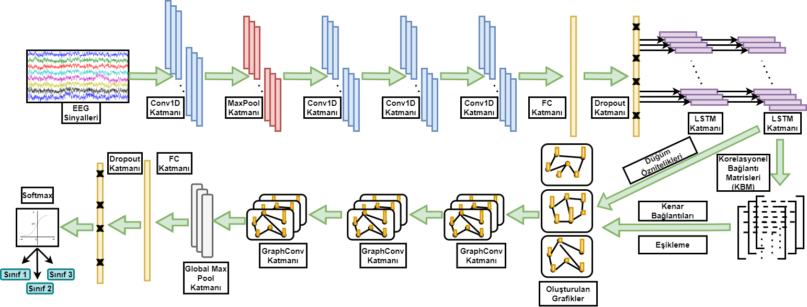
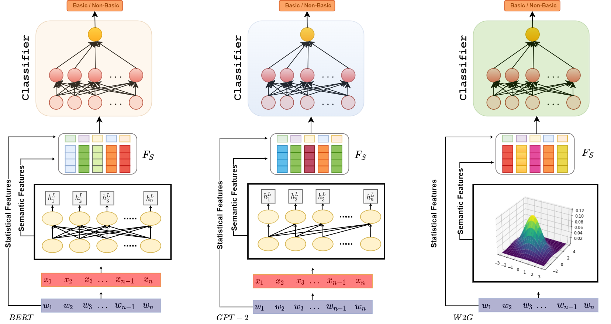
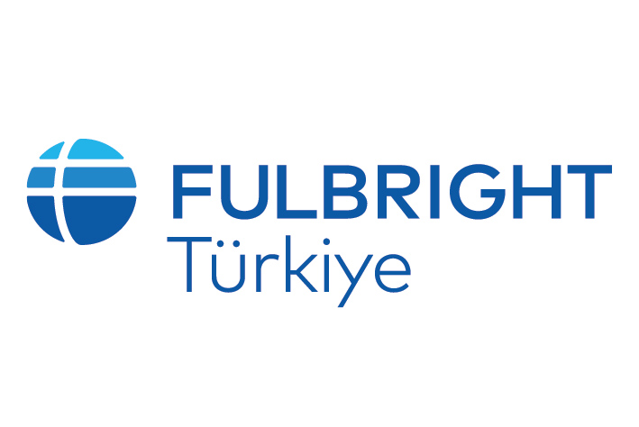
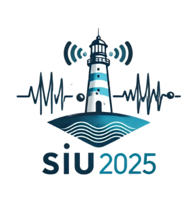
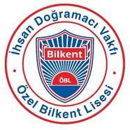

  <h1>Ecem Şimşek</h1>

  

    I’m an M.Sc. student in Electrical and Electronics Engineering department at Bilkent University. I am working on <strong>graph signal processing</strong>, <strong>graph neural networks</strong>, <strong>hypergraphs</strong>, and especially <strong>visibility graphs</strong> and their applications in fields ranging from natural language processing to time series analysis. I’m particularly interested in developing graph-based methods theoretically, and making their applications using graph neural networks.
  

  

    I am also selected as a <strong>Principal Candidate</strong> for the 2026–2027 <strong>Fulbright Ph.D. scholarship</strong>. Scroll down for more!
  

  <ul class="links">
    <li>
      <a href="mailto:ecem.simsek@bilkent.edu.tr">
        <i class="fa fa-envelope" aria-hidden="true"></i>Email
      </a>
    </li>
    <li>
      <a href="assets/Ecem_Simsek_Resume.pdf">
        <i class="fa fa-file-text-o" aria-hidden="true"></i>CV
      </a>
    </li>
    <li>
      <a href="https://scholar.google.com/citations?user=ZrC2RNwAAAAJ" target="_blank" rel="noopener">
        <i class="ai ai-google-scholar" aria-hidden="true"></i>Google Scholar
      </a>
    </li>
    <li>
      <a href="https://github.com/ecemsimsekk" target="_blank" rel="noopener">
        <i class="fa fa-github" aria-hidden="true"></i>GitHub
      </a>
    </li>
    <li>
      <a href="https://www.linkedin.com/in/ecem-%C5%9Fim%C5%9Fek-3601b618b/" target="_blank" rel="noopener">
        <i class="fa fa-linkedin" aria-hidden="true"></i>LinkedIn
      </a>
    </li>
  </ul>

## Education

  

    
    

      
<strong>M.Sc., Electrical &amp; Electronics Engineering</strong> — Bilkent University (Ankara, TR)

      
Advisor: Asst. Prof. Aykut Koç • CGPA: 3.67

    

    2023–present
  

  

    
    

      
<strong>B.Sc., Electrical &amp; Electronics Engineering</strong> — Bilkent University (Ankara, TR)

      
Cum Laude • CGPA: 3.20

    

    2018–2023
  

## Professional Experience

  

    
    

      
<strong>UMRAM (National Magnetic Resonance Center)</strong> — <em>Graduate Researcher</em>

      <ul>
        <li>Working under the supervision of Asst. Prof. Aykut Koç.</li>
        <li>Making research on visibility graphs, hypergraphs, and their utilizations in domains ranging from natural language processing to time series analysis.</li>
      </ul>
    

    June 2023-Present
  

  

    
    

      
<strong>UMRAM (National Magnetic Resonance Center)</strong> — <em>Undergraduate Researcher</em>

      <ul>
        <li>Worked under the supervision of Asst. Prof. Aykut Koç.</li>
        <li>Made research on graph neural networks, visibility graphs, and their utilization in text classification.</li>
      </ul>
    

    2022-2023
  

  

    
    

      
<strong>UMRAM (National Magnetic Resonance Center)</strong> — <em>Research Intern</em>

      <ul>
        <li>Worked under the supervision of Prof. Ergin Atalar.</li>
        <li>Worked on and made research about acquisition and real-time display of digitized signals.</li>
        <li>Developed a Direct Memory Access pipeline in VHDL for high-speed analog-to-digital converter on Xilinx VC707 FPGA.</li>
      </ul>
    

    2020-2021
  

## Publications

  Selected publications are <mark>highlighted</mark>. The list of my publications can also be found in
  <a href="https://scholar.google.com/citations?user=ZrC2RNwAAAAJ" target="_blank" rel="noopener">Google Scholar</a>.

<!-- IMPORTANT: markdown="0" prevents kramdown from treating this HTML as code -->

  <!-- EmoVis — featured -->
  <article class="pub featured">
    
    

      

        <a href="https://ieeexplore.ieee.org/abstract/document/10985783" target="_blank" rel="noopener">
          Emotion Classification with Visibility Graphs (EmoVis)
        </a>
      

      
<strong>Ecem Şimşek</strong>, Atakan Topcu, Emirhan Koç, Emine Ülkü Sarıtaş, Aykut Koç

      
<em>IEEE Signal Processing Letters (SPL)</em>

      

        
abstract

        

          Transformers have gained prominence in natural language processing due to their representational capabilities and performances. Transformers process natural language as a sequence on finite context windows; however, global relationships among words beyond these windows cannot be completely modeled via sequence processing only. Graph neural network (GNN) based models have been proposed to alleviate this problem, as they provide geometric extensions to neural networks, enabling models to learn associations within a text. However, regular graph-based methods ignore the sequential nature of underlying texts. In this paper, we propose EmoVis, the first generic graph-based neural network that utilizes visibility graphs, which converts classical time-series information to graph representations. We cast the problem as an emotion classification task, enabling the proposed model to learn associations between the labels and words in a sentence. Moreover, EmoVis can be used as a highly modular graph-based extension to any transformer-based model, significantly improving their performance and learning capabilities in various languages. We experimentally show that EmoVis enables transformer-based models to outperform the state-of-the-art baselines across three diverse datasets in different languages in the SemEval2018 competition datasets and the GoEmotions dataset.
        

      

    

  </article>

  <!-- FrVis — featured -->
  <article class="pub featured">
    
    

      

        <!-- <a href=" " target="_blank" rel="noopener"-->
          Fractional Fourier-Guided Visibility Graphs
        <!--</a>-->
      

      
<strong>Ecem Şimşek</strong>, Haldun Özaktaş, Aykut Koç

      
<em>To be submitted to IEEE Signal Processing Letters (SPL)</em>

      

        
abstract

        

        

      

    

  </article>

  <!-- EpiGraphNet -->
  <article class="pub">
    
    

      

        <a href="https://ieeexplore.ieee.org/abstract/document/11111837" target="_blank" rel="noopener">
          EpiGraphNet: Epilepsy Recognition Architecture with Graph-Based EEG Analysis
        </a>
      

      
<strong>Ecem Şimşek</strong>, Emirhan Koç, Aykut Koç

      
<em>IEEE Signal Processing and Communications Applications Conference (SIU)</em>

      

        
abstract

        

          Early and accurate detection of epileptic seizures is crucial for patients' quality of life and the treatment process. In this context, our study proposes EpiGrafNet, an innovative hybrid model that delivers high performance in epileptic seizure detection using electroencephalography (EEG) signals. The proposed method extracts both local and long-term temporal features from EEG signals via a one-dimensional convolutional neural network (CNN) and long short-term memory (LSTM) module; these features are then transformed into a graph structure by the utilization of correlation connection matrices (CCM), and integrated with graph convolutional neural networks (GCN). Experiments conducted with different sparsity values demonstrate that the developed model achieves superior accuracy, recall, precision, and F1 scores in both binary and multi-class epileptic seizure detection tasks, indicating that EpiGrafNet provides higher and more reliable results compared to existing methods. This approach, by effectively modeling the complex spatial and temporal relationships in EEG signals, significantly contributes to the development of automatic epileptic seizure detection systems in clinical applications.
        

      

    

  </article>

  <!-- Wind Power -->
  <article class="pub">
    
    

      

        <a href="https://ieeexplore.ieee.org/document/10223936" target="_blank" rel="noopener">
          Wind Power Prediction Using Machine Learning and Deep Learning Algorithms
        </a>
      

      
<strong>Ecem Şimşek</strong>, Ayşemüge Güngör, Öykü Karavelioğlu, Mustafa Tolga Yerli, Nejat Göktuğ Kuyumcuoğlu

      
<em>IEEE Signal Processing and Communications Applications Conference (SIU)</em>

      

        
abstract

        

          In this study, it has been tried to predict the wind power generation values in a long-term period by using a dataset containing the wind power generation values of 10 zones using machine learning and deep learning methods. In this context, the importance of accurately predicting renewable energy production was emphasized by associating it with machine learning and deep learning methods. The methods to be used in the study were selected based on the literature review and the characteristics of the time series datasets. Since the dataset includes the basic wind components, a detailed feature analysis was performed, and the dataset was enriched with the newly added features. The hyperparameters of the utilized models were optimized for all regions in the dataset separately and the models were run with these hyperparameters. The results of the models were evaluated with different error metrics and compared with each other, and the models with the lowest error scores were determined.
        

      

    

  </article>

  <!-- Basic Level Categories -->
  <article class="pub">
    
    

      

        <a href="https://ieeexplore.ieee.org/document/11112453" target="_blank" rel="noopener">
          Automatic Detection of Basic Level Categories
        </a>
      

      
Emirhan Koç, İrem Şanlı, <strong>Ecem Şimşek</strong>, Hasan Özekin, Aykut Koç

      
<em>IEEE Signal Processing and Communications Applications Conference (SIU)</em>

      

        
abstract

        

          Basic level categories (BLCs), which can be defined as the most inclusive level at which a concrete mental image of the entire category can be formed, have proven to be useful in a variety of applications in natural language processing (NLP) and computer vision (CV) tasks, such as word sense disambiguation, image searches, image description, and retrieval. Limiting their practical applications, current methods for detecting BLCs predominantly rely on rule-based methods and external knowledge sources rather than the information extracted directly from the text. In this manuscript, we propose a novel approach to detect BLCs that is merely based on the information obtained from the word embeddings, including Gaussian word embeddings (W2G) and embeddings retrieved from transformer-based models such as BERT and GPT-2. The proposed method significantly outperforms existing works in performance and practicality, demonstrating the effectiveness of contextual word embeddings for BLC detection.
        

      

    

  </article>

## Honors and Awards

<!-- Converted to logo cards; keep assets under assets/logos/ -->

  

    
    

      
<strong>Principal Candidate</strong>, Fulbright Ph.D. Scholarship (2026–2027)

      
Selected for national nomination to the Fulbright doctoral scholarship cohort.

    

  

  

    
    

      
<strong>1st Place</strong>, 5-Minute Thesis Competition (M.Sc.), IEEE SIU 2025 Conference

      
Best presentation award among graduate finalists in IEEE SIU 2025 Conference held at Işık University.

    

  

  

    
    

      
<strong>5G and Beyond Graduate Support Scholarship</strong>, BTK / Türk Telekom

      
Competitive research scholarship supporting graduate study, awarded by the Information and Communication Technologies Authority of Turkey (BTK), funded by Türk Telekom company.

    

  

  

    
    

      
<strong>Full Academic Scholarship</strong>, I.D.F. Bilkent High School

      
Awarded based on top-3 performance in graduation from I.D.F. Bilkent Middle School.

    

  

## Teaching

  

    
🎓

    

      
Teaching and Mentoring

      

        
EEE493/494 — <strong>Industrial Design Project</strong> (Bilkent University)

        
Graduate TA • 2023–present

        
EEE342 — <strong>Feedback Control Systems</strong> (Bilkent University)

        
Lab Assistant • 2022–2023

        
CS115 — <strong>Introduction to Python Programming </strong>(Bilkent University)

        
Lab Assistant • 2020–2021, 2022

      

    

  

## Skills

  

    
🛠️

    

      
Skill Sets

      

        

          
Core

          <ul class="pills">
            <li class="pill">Deep Learning</li>
            <li class="pill">Signal Processing</li>
            <li class="pill">Graph Signal Processing</li>
            <li class="pill">Graph Neural Networks</li>
            <li class="pill">Natural Language Processing</li>
            <li class="pill">Time Series Analysis</li>
          </ul>
        

        

          
Programming & Tools

          <ul class="pills">
            <li class="pill">Python</li>
            <li class="pill">PyTorch</li>
            <li class="pill">PyTorch-Geometric</li>
            <li class="pill">TensorFlow</li>
            <li class="pill">MATLAB</li>
            <li class="pill">VHDL</li>
            <li class="pill">Vivado</li>
            <li class="pill">Arduino</li>
            <li class="pill">Cadence&nbsp;Virtuoso</li>
            <li class="pill">LTSpice</li>
            <li class="pill">Streamlit</li>
            <li class="pill">LaTeX</li>
          </ul>
        

        

          
Languages

          <ul class="pills">
            <li class="pill">English</li>
            <li class="pill">French (beginner)</li>
            <li class="pill">Spanish (beginner)</li>
          </ul>
        

      

    

  

<footer class="site-footer">
  
Template is from <a href="https://bamos.github.io/" target="_blank" rel="noopener">Brandon Amos</a>.

</footer>